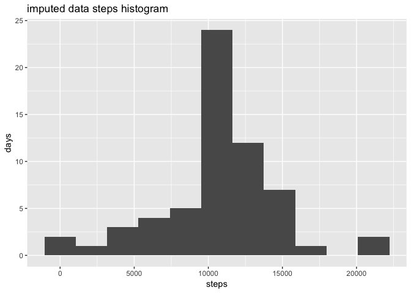

###1.  Code for reading in the dataset and/or processing the data


```r
#load packages
library(dplyr)
```

```
## Warning: package 'dplyr' was built under R version 3.5.1
```

```
## 
## Attaching package: 'dplyr'
```

```
## The following objects are masked from 'package:stats':
## 
##     filter, lag
```

```
## The following objects are masked from 'package:base':
## 
##     intersect, setdiff, setequal, union
```

```r
library(ggplot2)
library(gridExtra)
```

```
## 
## Attaching package: 'gridExtra'
```

```
## The following object is masked from 'package:dplyr':
## 
##     combine
```

```r
#import data
activityData<-read.csv("activity.csv")
#formate date column as Date class
activityData$date<-as.Date(activityData$date)
```

###2.  Histogram of the total number of steps taken each day


```r
#filter data and sum steps by data remove na
byDateData<-activityData %>% 
     group_by(date) %>%
     summarize(steps= sum(steps)) %>%
     filter(is.na(steps)==FALSE)

#generate hisotgram
ggplot(byDateData, aes(x=date, y=steps)) +
     geom_col() +
     labs(title = "steps by day", y="sum of steps")
```

<!-- -->

###3.  Mean and median number of steps taken each day
+ mean number of steps per day

```r
print(mean(byDateData$steps))
```

```
## [1] 10766.19
```

+ median number of steps per day

```r
print(median(byDateData$steps))
```

```
## [1] 10765
```

###4.  Time series plot of the average number of steps taken


```r
#filter data remove NA, group by interval and sumarize the mean number of steps
byIntDataMean<-activityData %>% 
     filter(is.na(steps)==FALSE) %>%
     group_by(interval) %>%
     summarize(steps= mean(steps)) 

#plot steps by interval
ggplot(byIntDataMean, aes(x=interval, y=steps)) +
     geom_line() + 
     labs(title = "steps per 5 minute interval", y="mean steps")
```

<!-- -->

###5.  The 5-minute interval that, on average, contains the maximum number of steps


```r
topInterval<-byIntDataMean %>%
    top_n(1, steps)

print(topInterval)
```

```
## # A tibble: 1 x 2
##   interval steps
##      <int> <dbl>
## 1      835  206.
```

###6.  Code to describe and show a strategy for imputing missing data
imputed the missing data by replacing NA values with the mean of the non-NA values for that interval across all timepoints.


```r
impData<-activityData %>% 
     group_by(interval) %>%
     mutate(steps = ifelse(is.na(steps), mean(steps, na.rm = TRUE), steps)) 
```

###7.  Histogram of the total number of steps taken each day after missing values are imputed


```r
#filter group by date and sumarize the sum of steps

byDateImpData<-impData %>% 
     group_by(date) %>%
     summarize(steps= sum(steps))

#plot sum of steps by date
ggplot(byDateImpData, aes(x=date, y=steps)) +
     geom_col() + 
     labs(title = "Imputed steps by day", y="sum of steps")
```

<!-- -->

###8.  Panel plot comparing the average number of steps taken per 5-minute interval across weekdays and weekends


```r
#create a column of days using mutate with weekdays function, remove NAs, filter by week days, group by interval and summarize the mean steps
byIntDataMeanWD<-activityData %>% 
     mutate(day=weekdays(date)) %>%
     filter(is.na(steps)==FALSE) %>%
     filter(day %in% c("Monday", "Tuesday", "Wednesday", "Thursday", "Friday")==TRUE) %>%
     group_by(interval) %>%
     summarize(steps= mean(steps)) 

#store plot mean of steps by interval for weekdays
WDplot<-ggplot(byIntDataMeanWD, aes(x=interval, y=steps)) +
     geom_line() + 
     labs(title = "Weekdays", y="mean steps")

#create a column of days using mutate and weekdays function, remove NA, filter by week ends, group by interval and summarize the mean steps
byIntDataMeanWE<-activityData %>% 
     mutate(day=weekdays(date)) %>%
     filter(is.na(steps)==FALSE) %>%
     filter(day %in% c("Saturday", "Sunday")==TRUE) %>%
     group_by(interval) %>%
     summarize(steps= mean(steps)) 

#store plot mean of steps by interval for weekends
WEplot<-ggplot(byIntDataMeanWE, aes(x=interval, y=steps)) +
     geom_line()+ 
     labs(title = "Weekends", y="mean steps")

#return plots in with grid arrange function from gridExtra library
grid.arrange(WDplot, WEplot, ncol=2)
```

<!-- -->


